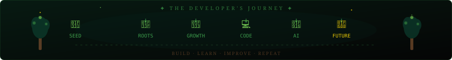

<div align="center">

<!-- ═══════════════════════════════════════════════════════════ -->
<!--                   🌱 ANIMATED HERO BANNER                  -->
<!-- ═══════════════════════════════════════════════════════════ -->


<br/>

<!-- Typing animation via readme-typing-svg -->
<a href="https://github.com/Tamil0219">
  
</a>

<br/><br/>

<!-- Profile visitor badge -->


</div>

---

<!-- ═══════════════════════════════════════════════════════════ -->
<!--                   🌿 JOURNEY VISUAL                        -->
<!-- ═══════════════════════════════════════════════════════════ -->

<div align="center">

</div>

<br/>

<!-- ═══════════════════════════════════════════════════════════ -->
<!--                   🌱 ROOTS — ABOUT ME                      -->
<!-- ═══════════════════════════════════════════════════════════ -->

<div align="center">

## 🌱 ROOTS — ABOUT ME

</div>

```
┌─────────────────────────────────────────────────────────────────┐
│                                                                 │
│   🌱  DESIGNATION  :  Tamilselvan K.                           │
│   🎓  COLLEGE      :  V.S.B Engineering College, Karur         │
│   📚  DEGREE       :  B.Tech — Information Technology          │
│   📅  BATCH        :  2023 – 2027                              │
│   ⭐  CGPA         :  7.77                                     │
│   🎯  MISSION      :  Build intelligent, impactful software    │
│                                                                 │
└─────────────────────────────────────────────────────────────────┘
```

I am **Tamilselvan K.**, a B.Tech Information Technology student passionate about
software development, problem solving, and AI-powered applications.

I enjoy building practical projects, learning new technologies, and continuously
growing my programming skills — one branch at a time.

> *"A tree grows one branch at a time. A developer grows one line of code at a time."*

<br/>

**🌿 What drives me:**

| 💻 Developer | 🤖 AI Explorer | 🧠 Problem Solver | 🌱 Continuous Learner |
|:---:|:---:|:---:|:---:|
| Building practical apps | AI-powered systems | DSA & Algorithms | Always growing |

<br/>

<div align="center">

</div>

<br/>

<!-- ═══════════════════════════════════════════════════════════ -->
<!--              🌿 MY BRANCHES — TECH STACK                   -->
<!-- ═══════════════════════════════════════════════════════════ -->

<div align="center">

## 🌿 MY BRANCHES — TECH STACK

</div>

### 🌱 Programming Languages

<div align="center">


</div>

### 🌿 Web Development

<div align="center">


</div>

### 🌳 Database & Tools

<div align="center">


</div>

### 🤖 AI / Data

<div align="center">


</div>

### 🧠 Core Concepts

<div align="center">


</div>

<br/>

<div align="center">

</div>

<br/>

<!-- ═══════════════════════════════════════════════════════════ -->
<!--             🌌 FEATURED — AI KNOWLEDGE ASSISTANT           -->
<!-- ═══════════════════════════════════════════════════════════ -->

<div align="center">

## 🌌 FEATURED PROJECT — AI KNOWLEDGE ASSISTANT

*The crown jewel of the forest*

</div>

```
╔══════════════════════════════════════════════════════════════╗
║                                                              ║
║   🌌  AI KNOWLEDGE ASSISTANT                                 ║
║                                                              ║
║   An intelligent document-based Q&A system powered by AI.   ║
║   Feed it knowledge — it gives you answers.                  ║
║                                                              ║
║   ┌──────────┐    ┌──────────┐    ┌──────────┐              ║
║   │ DOCUMENT │ ─► │ PROCESS  │ ─► │ VECTORIZE│              ║
║   └──────────┘    └──────────┘    └──────────┘              ║
║                                        │                     ║
║                                        ▼                     ║
║   ┌──────────┐    ┌──────────┐    ┌──────────┐              ║
║   │  ANSWER  │ ◄─ │    AI    │ ◄─ │  SEARCH  │              ║
║   └──────────┘    └──────────┘    └──────────┘              ║
║                                                              ║
║   🛠  Python  ·  AI APIs  ·  FastAPI  ·  NLP                ║
║                                                              ║
╚══════════════════════════════════════════════════════════════╝
```

<div align="center">

**[🌱 VIEW PROJECT → AI Knowledge Assistant](https://github.com/Tamil0219/AI_Knowledge_Assistant)**

</div>

<br/>

<div align="center">

</div>

<br/>

<!-- ═══════════════════════════════════════════════════════════ -->
<!--               🌳 MY FOREST — ALL PROJECTS                  -->
<!-- ═══════════════════════════════════════════════════════════ -->

<div align="center">

## 🌳 MY FOREST — PROJECTS

*Each project is a branch. Each branch tells a story.*

</div>

---

### 🤖 SmartSkill AI — AI Adaptive Learning & Exam Generator

```
        🌿 SmartSkillAi
       /
 ROOT ─┤  AI-powered adaptive learning platform that studies
       \  the learner and auto-generates exams at the right
        \ difficulty level in real time.
         🌱
```

| | |
|---|---|
| 🛠 **Tech Stack** | JavaScript · AI · Full-Stack |
| 🎯 **Purpose** | Adaptive education powered by artificial intelligence |
| 🏷 **Category** | AI · EdTech · Automation |
| 🔗 **Repository** | **[View SmartSkillAi →](https://github.com/Tamil0219/SmartSkillAi)** |

---

### 🧠 Smart Sentimental Analysis — NLP Review Classifier

```
        🌿 Smart-Sentimental-Analysis
       /
 ROOT ─┤  NLP-powered classifier that reads Play Store reviews
       \  and categorizes them as positive, negative, or neutral.
        \ Giving developers real signal from user feedback.
         🌱
```

| | |
|---|---|
| 🛠 **Tech Stack** | Python · HTML · NLP · Data Analysis |
| 🎯 **Purpose** | Sentiment classification for app review data |
| 🏷 **Category** | NLP · Machine Learning · Data |
| 🔗 **Repository** | **[View Project →](https://github.com/Tamil0219/Smart-Sentimental-Analysis)** |

---

### 📚 Library Management System — Smart Archive

```
        🌿 Library-management-system
       /
 ROOT ─┤  Automated book issuing, return tracking, and record
       \  maintenance — built for organised, efficient library ops.
        \ Even the forest needs a well-ordered archive.
         🌱
```

| | |
|---|---|
| 🛠 **Tech Stack** | JavaScript · Java · Database |
| 🎯 **Purpose** | Automate library operations and record management |
| 🏷 **Category** | System Design · Web App |
| 🔗 **Repository** | **[View Project →](https://github.com/Tamil0219/Library-management-system-)** |

---

<br/>

<div align="center">

</div>

<br/>

<!-- ═══════════════════════════════════════════════════════════ -->
<!--              🌲 MY GROWTH — GITHUB STATS                   -->
<!-- ═══════════════════════════════════════════════════════════ -->

<div align="center">

## 🌲 MY GROWTH — GITHUB STATS

</div>

<div align="center">


</div>

<div align="center">


</div>

<br/>

<div align="center">

</div>

<br/>

<!-- ═══════════════════════════════════════════════════════════ -->
<!--              🍃 LEAVES OF CODE — CONTRIBUTIONS             -->
<!-- ═══════════════════════════════════════════════════════════ -->

<div align="center">

## 🍃 LEAVES OF CODE — CONTRIBUTIONS

*The forest grows with every commit*

</div>

<div align="center">

```
  Contribution Level
  ─────────────────────────────────────
  🌱  Low Activity     →  A seed is planted
  🌿  Growing          →  Branches are forming
  🌳  High Activity    →  The forest is thriving
  ─────────────────────────────────────
  Every commit is a leaf.
  Every push is a branch.
  Every project is a tree.
```

</div>

<div align="center">


</div>

<br/>

<div align="center">

</div>

<br/>

<!-- ═══════════════════════════════════════════════════════════ -->
<!--              🌱 CURRENTLY GROWING                          -->
<!-- ═══════════════════════════════════════════════════════════ -->

<div align="center">

## 🌱 CURRENTLY GROWING

*Learning · Exploring · Building*

</div>

<div align="center">

| 🌿 Technology | 📊 Status | 🎯 Goal |
|:---|:---:|:---|
| ☕ **Java** | `Learning` | Strong OOP & backend foundations |
| 📐 **Data Structures & Algorithms** | `Practicing` | Problem-solving excellence |
| 🌐 **JavaScript / Full-Stack** | `Building with` | End-to-end web applications |
| 🤖 **AI Applications** | `Exploring` | Intelligent, useful AI tools |
| 🗄 **SQL & Databases** | `Learning` | Efficient data management |
| ⚡ **React** | `Exploring` | Modern, responsive UIs |
| 🐍 **Python** | `Building with` | AI & data projects |

</div>

<br/>

<div align="center">

</div>

<br/>

<!-- ═══════════════════════════════════════════════════════════ -->
<!--              🌳 MY JOURNEY — TIMELINE                      -->
<!-- ═══════════════════════════════════════════════════════════ -->

<div align="center">

## 🌳 MY JOURNEY

</div>

```
🌱  START
│
├── ☕  Java Fundamentals
│         └── OOP, Classes, Interfaces, Exception Handling
│
├── 🧠  Data Structures & Algorithms
│         └── Arrays, LinkedLists, Trees, Sorting, Searching
│
├── 🌐  Web Development
│         └── HTML · CSS · JavaScript · React
│         └── Node.js · Express.js · REST APIs
│
├── 🗄  Databases
│         └── MongoDB · MySQL · SQL
│
├── 🤖  AI / ML Projects
│         └── NLP Sentiment Analysis
│         └── AI Knowledge Assistant
│         └── Adaptive Learning & Exam Generator
│
├── 💼  Internship Experience
│         └── Infosys Virtual Internship — Full Stack Dev
│
└── 🚀  NEXT LEVEL
          └── Contributing to open source
          └── Deeper AI / ML specialisation
          └── Landing a great software role
```

<br/>

<div align="center">

**BUILD → LEARN → IMPROVE → REPEAT**

</div>

<br/>

<div align="center">

</div>

<br/>

<!-- ═══════════════════════════════════════════════════════════ -->
<!--         📜 ANCIENT SCROLLS — CERTIFICATIONS                -->
<!-- ═══════════════════════════════════════════════════════════ -->

<div align="center">

## 📜 ANCIENT SCROLLS — CERTIFICATIONS

*Knowledge earned through disciplined study*

</div>

<div align="center">

| 🏅 Certification | 🏛 Issuer | 🎖 Badge |
|:---|:---:|:---:|
| **Programming in Java** | NPTEL | `Elite` |
| **Java Foundation** | Infosys Springboard | `Certified` |
| **Python Foundation** | Infosys Springboard | `Certified` |
| **Full Stack Development** | Infosys Virtual Internship | `Completed` |

</div>

<br/>

<div align="center">

</div>

<br/>

<!-- ═══════════════════════════════════════════════════════════ -->
<!--              🌿 WHAT I BUILD                               -->
<!-- ═══════════════════════════════════════════════════════════ -->

<div align="center">

## 🌿 WHAT I BUILD

</div>

<div align="center">

| 🌱 Software | 🤖 AI | 🌐 Web | 🧠 Problem Solving |
|:---:|:---:|:---:|:---:|
| Practical applications and utilities that solve real problems | AI-powered systems, NLP tools, and intelligent assistants | Full-stack web apps with clean interfaces | DSA challenges, algorithms, and logical thinking |

</div>

<br/>

<div align="center">

</div>

<br/>

<!-- ═══════════════════════════════════════════════════════════ -->
<!--              🌳 MY PHILOSOPHY                              -->
<!-- ═══════════════════════════════════════════════════════════ -->

<div align="center">

## 🌳 MY PHILOSOPHY

</div>

<div align="center">

> *"A tree grows one branch at a time.*
> *A developer grows one line of code at a time."*

</div>

<br/>

<div align="center">

```
  🌱 Learn    ─►    🔨 Build    ─►    💥 Break    ─►    🔧 Fix    ─►    🌳 Grow
```

</div>

<br/>

<div align="center">

</div>

<br/>

<!-- ═══════════════════════════════════════════════════════════ -->
<!--              🌌 CONNECT WITH ME                            -->
<!-- ═══════════════════════════════════════════════════════════ -->

<div align="center">

## 🌌 CONNECT WITH ME

*The roots reach out — let's grow together*

</div>

<div align="center">

[](https://github.com/Tamil0219)

</div>

<br/>

<div align="center">

```
  Open to:
  ✅  Software Developer roles
  ✅  Internship opportunities
  ✅  Full-Stack projects
  ✅  AI / ML collaborations
  ✅  Open-source contributions
```

</div>

<br/>

<div align="center">

</div>

<br/>

<!-- ═══════════════════════════════════════════════════════════ -->
<!--                   🌱 FOOTER                               -->
<!-- ═══════════════════════════════════════════════════════════ -->

<div align="center">


<br/>

### 🌱 Keep Growing. Keep Building.

<br/>

```
  ╔══════════════════════════════════════╗
  ║                                      ║
  ║      🌿  I AM TAMILSELVAN.           ║
  ║                                      ║
  ║      🌳  I AM CODE.                  ║
  ║                                      ║
  ╚══════════════════════════════════════╝
```

*Built with curiosity, caffeine, and code.* ☕🌱

</div>
